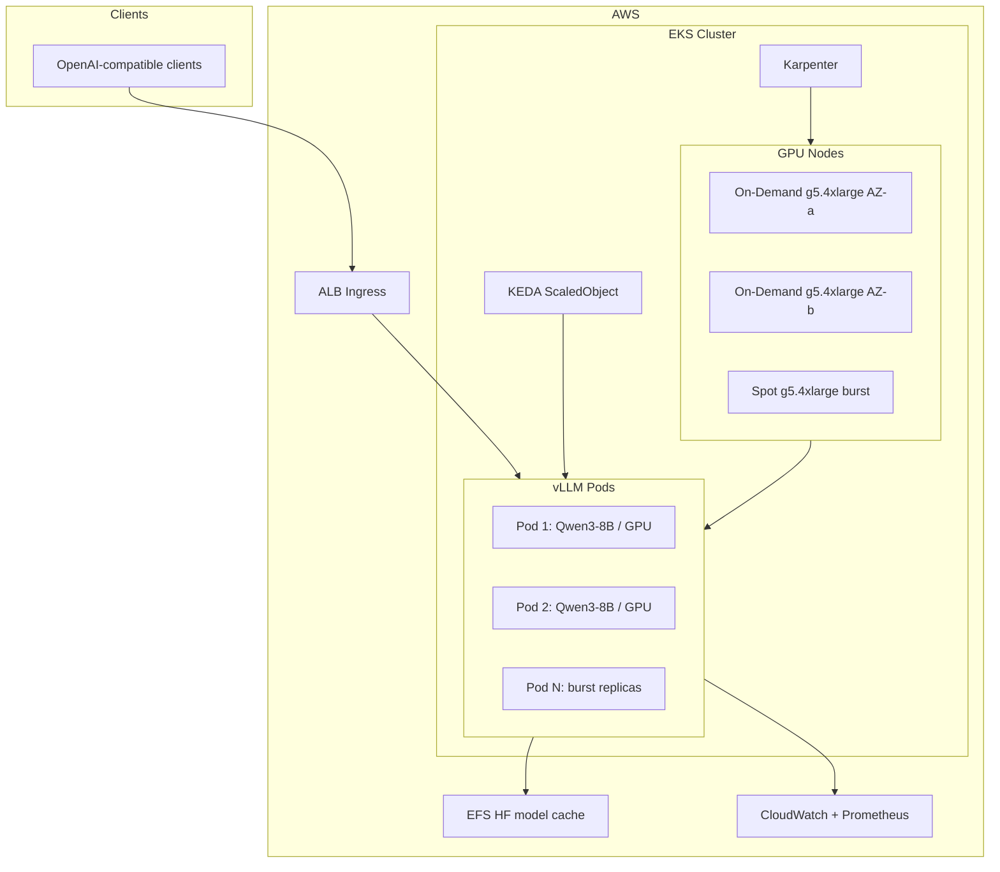

# EKS Production Plan: Qwen 8B + vLLM on G5

## Architecture



## Instance and GPU Sizing (validated)

| Environment | Instance | vCPU / RAM | GPU | Use case |
|---|---|---|---|---|
| Dev | `g5.xlarge` or `g5.2xlarge` | 4–8 / 16–32 GiB | 1× A10G 24GB | Single replica, low traffic |
| Prod baseline | `g5.4xlarge` | 16 / 64 GiB | 1× A10G 24GB | 1 model replica per GPU; enough host RAM for tokenizer + KV cache overhead |
| Prod burst | `g5.4xlarge` Spot | same | 1× A10G 24GB | Karpenter-provisioned scale-out |

**VRAM fit:** Qwen3-8B / Qwen2.5-7B at `bfloat16` uses ~16 GB weights. With `--max-model-len 8192`, `--gpu-memory-utilization 0.90`, and prefix caching, 24 GB A10G is appropriate for a single replica per GPU. Do not enable tensor parallelism (single-GPU workload).

**Why g5.4xlarge for prod:** `g5.xlarge` (16 GiB host RAM) is too tight for vLLM worker processes + OS; `g5.4xlarge` avoids OOM kills under concurrent requests.

## Target Production Shape

- **Baseline:** 2× On-Demand `g5.4xlarge`, spread across 2 AZs (1 replica each, minAvailable=2 for HA)
- **Burst:** Karpenter Spot `g5.4xlarge` pool, max 3–8 additional nodes depending on budget
- **Replicas:** KEDA min 2 / max 10 (1 pod per GPU via `nvidia.com/gpu: 1`)
- **Model:** `Qwen/Qwen3-8B` (swap to `Qwen2.5-7B` if licensing/registry preference differs)

## Repository Layout (greenfield)

```
eks/
├── terraform/
│   ├── modules/
│   │   ├── vpc/              # 2+ AZ, private subnets, NAT
│   │   ├── eks/              # EKS 1.29+, managed addons
│   │   ├── karpenter/        # IAM + SQS interruption queue
│   │   ├── alb-controller/   # AWS Load Balancer Controller IAM
│   │   ├── efs/              # EFS + mount targets + SG
│   │   └── ecr/              # vLLM image repo
│   └── environments/
│       └── prod/
│           ├── main.tf
│           ├── variables.tf
│           └── terraform.tfvars
├── kubernetes/
│   ├── karpenter/
│   │   ├── ec2nodeclass-g5.yaml
│   │   ├── nodepool-g5-ondemand.yaml
│   │   └── nodepool-g5-spot.yaml
│   ├── vllm/
│   │   ├── namespace.yaml
│   │   ├── configmap.yaml
│   │   ├── pvc-efs.yaml
│   │   ├── deployment.yaml
│   │   ├── service.yaml
│   │   ├── ingress.yaml
│   │   └── keda-scaledobject.yaml
│   ├── gpu/
│   │   └── nvidia-device-plugin.yaml   # or GPU Operator Helm values
│   └── monitoring/
│       ├── servicemonitor.yaml
│       └── cloudwatch-agent.yaml
└── docker/
    └── Dockerfile.vllm                   # pin vLLM + CUDA version
```

## Terraform Modules (what each provisions)

### 1. VPC ([terraform/modules/vpc/](terraform/modules/vpc/))
- 2–3 AZs, public + private subnets
- NAT Gateway (1 for dev cost savings; 1 per AZ for prod HA)
- Tags for Karpenter discovery: `karpenter.sh/discovery: <cluster-name>`

### 2. EKS ([terraform/modules/eks/](terraform/modules/eks/))
- EKS cluster (1.29+), OIDC provider
- **Managed node group (system):** small `m6i.large` On-Demand nodes for CoreDNS, Karpenter controller, ALB controller, KEDA — **no GPU workloads here**
- Addons: `vpc-cni`, `coredns`, `kube-proxy`, `aws-ebs-csi-driver`
- IRSA roles for: Karpenter, ALB Controller, EFS CSI, CloudWatch agent

### 3. Karpenter ([terraform/modules/karpenter/](terraform/modules/karpenter/))
- Controller Helm release via Terraform `helm_release`
- Node IAM role + `PassRole`, SQS queue for Spot interruption handling
- Two NodePools (applied via kubectl/terraform kubectl provider after cluster ready):

**On-Demand baseline pool:**
```yaml
# nodepool-g5-ondemand.yaml (essential fields)
requirements:
  - key: karpenter.k8s.aws/instance-family
    operator: In
    values: ["g5"]
  - key: karpenter.k8s.aws/instance-size
    operator: In
    values: ["4xlarge"]
  - key: karpenter.sh/capacity-type
    operator: In
    values: ["on-demand"]
  - key: topology.kubernetes.io/zone
    operator: In
    values: ["<az-a>", "<az-b>"]
limits:
  cpu: "32"    # caps at ~2 g5.4xlarge
disruption:
  consolidationPolicy: WhenEmptyOrUnderutilized
  consolidateAfter: 30m
```

**Spot burst pool:**
```yaml
requirements:
  - key: karpenter.k8s.aws/instance-family
    operator: In
    values: ["g5"]
  - key: karpenter.k8s.aws/instance-size
    operator: In
    values: ["4xlarge", "2xlarge"]   # fallback if 4xlarge spot scarce
  - key: karpenter.sh/capacity-type
    operator: In
    values: ["spot"]
limits:
  cpu: "128"   # up to ~8 g5.4xlarge burst
```

### 4. EFS ([terraform/modules/efs/](terraform/modules/efs/))
- Shared HF model cache mounted at `/models` — avoids re-downloading ~16 GB per new node
- Performance mode: general purpose; throughput: bursting (upgrade to provisioned if cold-start latency is unacceptable)

### 5. ECR + ALB Controller
- Private ECR repo for pinned vLLM image
- ALB Ingress Controller with IRSA

## vLLM Deployment

### Container command (production defaults)
```bash
python -m vllm.entrypoints.openai.api_server \
  --model /models/Qwen3-8B \
  --host 0.0.0.0 \
  --port 8000 \
  --dtype bfloat16 \
  --max-model-len 8192 \
  --gpu-memory-utilization 0.90 \
  --enable-prefix-caching \
  --disable-log-requests
```

### Pod spec essentials ([kubernetes/vllm/deployment.yaml](kubernetes/vllm/deployment.yaml))
- `resources.limits.nvidia.com/gpu: "1"`
- `nodeSelector` or tolerations targeting GPU Karpenter nodes only
- **Init container:** download model from HuggingFace to EFS if not present (use HF token via External Secrets / SSM Parameter Store)
- **Probes:** `readinessProbe` and `livenessProbe` on `GET /health` (port 8000); `startupProbe` with generous `failureThreshold` (model load takes 2–5 min)
- **PodDisruptionBudget:** `minAvailable: 1` (or `minAvailable: 2` when running 2+ baseline replicas)
- **Topology spread:** `topology.kubernetes.io/zone` maxSkew=1 to keep replicas in different AZs

### Ingress ([kubernetes/vllm/ingress.yaml](kubernetes/vllm/ingress.yaml))
- AWS ALB Ingress, HTTPS termination at ALB (ACM cert)
- Target type: `ip`, health check path `/health`
- Idle timeout: 300s+ (LLM requests can be long)
- Optional: AWS WAF rate limiting in front of ALB

## Autoscaling Strategy

Two layers — do not conflate them:

| Layer | Tool | Scales | Trigger |
|---|---|---|---|
| **Pod replicas** | KEDA | vLLM Deployment | Prometheus metric or ALB request rate |
| **GPU nodes** | Karpenter | EC2 G5 instances | Pending pods with unsatisfied `nvidia.com/gpu` |

**KEDA ScaledObject** (preferred over CPU-based HPA for LLM):
**Scale on vLLM Prometheus metrics** (see `kubernetes/vllm/keda-scaledobject.yaml`):
- Primary: `vllm:queue_depth:sum` (waiting requests)
- Secondary: `max(vllm:gpu_cache_usage_perc)`
- Tertiary: `vllm:ttft:p95`
- Do **not** scale on `num_requests_running` alone — use queue depth instead
- Fallback: scale on ALB `RequestCountPerTarget` via CloudWatch scaler
- Example policy: scale out when GPU cache > 80% or queue depth > 5 for 60s; scale in after 10 min idle
- `minReplicaCount: 2`, `maxReplicaCount: 10`, `cooldownPeriod: 300`

**Karpenter** reacts automatically when KEDA adds GPU pods that cannot schedule — no separate Cluster Autoscaler needed.

## GPU Software Stack

Install **NVIDIA device plugin** (lighter) or **GPU Operator** (full lifecycle) on the system node group:

```bash
kubectl apply -f https://raw.githubusercontent.com/NVIDIA/k8s-device-plugin/v0.14.5/nvidia-device-plugin.yml
```

Verify: `kubectl get nodes -o json | jq '.items[].status.allocatable["nvidia.com/gpu"]'`

## Monitoring and Observability

- **vLLM built-in metrics:** scrape `:8000/metrics` via Prometheus ServiceMonitor
- **Key dashboards:** tokens/sec, time-to-first-token (TTFT), GPU cache usage, batch size, request queue depth
- **CloudWatch:** Container Insights for node-level CPU/RAM/GPU (via DCGM exporter sidecar optional)
- **Alerts:**
  - Pod not ready > 5 min
  - GPU cache usage > 95% sustained
  - Spot interruption rate spike
  - p99 latency > SLA threshold

## Cost / Performance Tradeoffs

| Choice | Cost impact | Performance / risk |
|---|---|---|
| 2× On-Demand baseline (HA) | ~$2,350/mo @ $1.62/hr × 2 × 730h | Stable latency; survives single AZ loss |
| Spot burst (up to 8 nodes) | ~$350–580/mo per node at ~60% discount | Interruption risk; Karpenter replaces node in ~2–3 min; use PDB + min 2 On-Demand |
| EFS vs EBS per node | EFS ~$0.30/GB/mo shared | Eliminates model re-download on scale-out; faster pod startup |
| `--enable-prefix-caching` | Neutral | 20–50% throughput gain on repeated system prompts |
| `max-model-len 8192` vs 32768 | Lower is cheaper | Longer context linearly increases KV cache VRAM; 8192 is safe on 24 GB |
| g5.2xlarge Spot for burst | ~40% cheaper than 4xlarge | Less headroom under concurrent load; acceptable for overflow only |

**Rough monthly prod estimate (us-east-1):**
- EKS control plane: ~$73
- 2× g5.4xlarge On-Demand: ~$2,350
- Avg 2 Spot burst nodes (50% duty): ~$580
- EFS 30 GB + NAT + ALB: ~$150
- **Total: ~$3,150/mo** (before data transfer)

## Rollout Sequence

1. Terraform: VPC → EKS + system node group → EFS → ECR → IRSA roles
2. Helm/kubectl: ALB controller, Karpenter, NVIDIA device plugin, KEDA
3. Apply Karpenter EC2NodeClass + NodePools; verify GPU node can launch
4. Pre-seed EFS with model weights (one-time Job)
5. Deploy vLLM with 1 replica; validate `/v1/chat/completions`
6. Enable KEDA autoscaling; load test to confirm Karpenter Spot burst
7. Enable monitoring dashboards and alerts
8. Scale baseline to 2 On-Demand replicas across AZs

## Key Risks and Mitigations

- **Spot interruption during inference:** Karpenter SQS handler + graceful termination (120s) + min 2 On-Demand replicas
- **Cold start on scale-out:** EFS model cache + pre-warm Job; consider keeping 1 idle replica above KEDA min during business hours
- **GPU quota:** Request `g5.4xlarge` quota increase in target region before deploy
- **ALB timeout:** Set idle timeout ≥ 300s; client-side timeouts must match

## Implementation Notes

- Pin vLLM version in [docker/Dockerfile.vllm](docker/Dockerfile.vllm) (e.g. `vllm/vllm-openai:v0.8.x`) — Qwen3 support requires recent vLLM
- Store `HF_TOKEN` in AWS Secrets Manager; sync via External Secrets Operator
- Use `terraform/environments/prod/` with remote state (S3 + DynamoDB lock)
- CI: `terraform plan` on PR; `kubectl diff` for manifest changes
