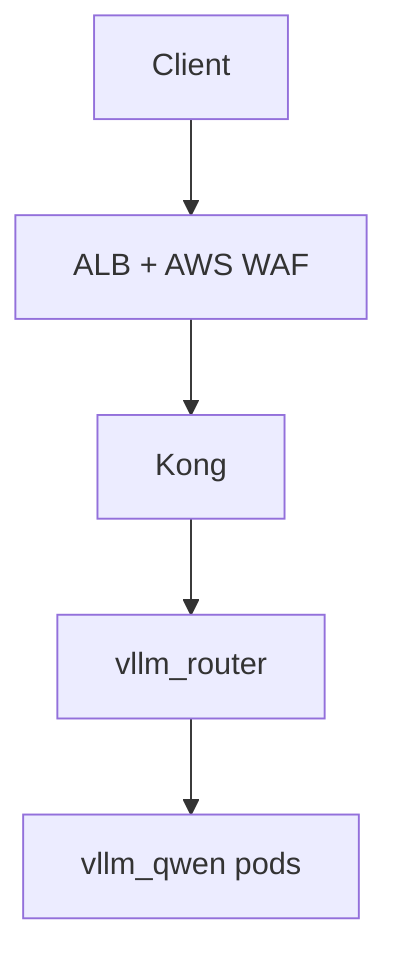

# Platform Gateway (Kong + WAF) — Phase 11

## Target architecture

WAF is **attached to the ALB**, not a separate network hop.



| Layer | Role |
|-------|------|
| **ALB + AWS WAF** | Public edge protection — TLS termination, idle timeout, IP rate limits, managed rule groups |
| **Kong** | Platform API gateway — API keys, per-key rate limit, body size, proxy timeouts, header pass-through |
| **vllm-router** | Inference/session/GPU routing |
| **vLLM pods** | Model serving |

**Naming clarity:** existing `make install-gateway` stays = router + LMCache (phases 1–9). New target: `make install-platform-gateway` = phase 11 Kong stack.

**Kong proxy Service name:** `vllm-platform-gateway-kong-proxy` (Helm release `vllm-platform-gateway` in namespace `vllm`).

## Enable flags ([`scripts/lib/env.sh`](scripts/lib/env.sh))

| Flag | Prod default | Dev |
|------|--------------|-----|
| `ENABLE_PLATFORM_GATEWAY` | `1` when `ENABLE_ALB=1` | `DEV_ENABLE_PLATFORM_GATEWAY=1` (requires `DEV_ENABLE_ALB=1` + `DEV_ENABLE_ROUTER=1`) |
| `ENABLE_WAF` | `1` when `ENABLE_ALB=1` | off (skip WAF on dev — cost + no Terraform ACL) |

Hard dependency: if `ENABLE_PLATFORM_GATEWAY=1`, force `ENABLE_ROUTER=1` (exit with clear error otherwise).

Ingress backend logic in [`scripts/patch-manifests.sh`](scripts/patch-manifests.sh):

```bash
if ENABLE_PLATFORM_GATEWAY=1 → INGRESS_BACKEND_SERVICE=vllm-platform-gateway-kong-proxy
elif ENABLE_ROUTER=1         → INGRESS_BACKEND_SERVICE=vllm-router
else                         → INGRESS_BACKEND_SERVICE=vllm-qwen
```

## Health vs readiness routes

**Critical:** ALB health check must not fail while vLLM is still loading models.

| Route | Auth | Purpose | ALB target |
|-------|------|---------|------------|
| `GET /health` | none | Kong process alive (200 from Kong itself — **does not** proxy to router/vLLM) | **yes** — ingress `healthcheck-path: /health` |
| `GET /ready` | none | Full stack readiness — proxy to `vllm-router:8000/health` (503 until backends Ready) | ops / CI only |

Implementation: `/health` uses Kong `request-termination` plugin (status 200) or equivalent self-check; `/ready` proxies upstream to router health.

## Timeout alignment (all layers = 300s)

| Layer | Setting |
|-------|---------|
| ALB | `idle_timeout.timeout_seconds=300` (existing ingress annotation) |
| Kong | `proxy_read_timeout: 300`, `proxy_send_timeout: 300` |
| Router | Verify upstream/proxy timeout ≥ 300s; add flag if router CLI supports it |
| Client docs | Recommend client read timeout ≥ 300s for streaming |

## 1. Terraform — AWS WAF v2 module

**New:** [`terraform/modules/waf/main.tf`](terraform/modules/waf/main.tf)

- `aws_wafv2_web_acl` (scope `REGIONAL`) with:
  - AWSManagedRulesCommonRuleSet — **`count` mode initially** (variable `waf_managed_rules_action`, default `count`)
  - AWSManagedRulesKnownBadInputsRuleSet — **`count` mode initially**
  - Rate-based rule: default **2000 req / 5 min / IP** (variable `waf_rate_limit`)
- CloudWatch metrics enabled
- **Rollout:** start prod in `count`; after 1–2 deploys and log review, flip variable to `block` to avoid blocking valid streaming / OpenAI payloads unexpectedly

**Wire in:** [`terraform/environments/prod/main.tf`](terraform/environments/prod/main.tf) only (not dev).

**Outputs:** add `waf_web_acl_arn` to prod [`outputs.tf`](terraform/environments/prod/outputs.tf).

**Ingress annotation** (patched when `ENABLE_WAF=1`):

```yaml
alb.ingress.kubernetes.io/wafv2-acl-arn: __WAF_WEB_ACL_ARN__
```

[`patch-manifests.sh`](scripts/patch-manifests.sh) reads `terraform output -raw waf_web_acl_arn` on prod; omits annotation on dev.

## 2. Kong Gateway (Helm, DB-less)

**Pin version** in [`scripts/lib/chart-versions.sh`](scripts/lib/chart-versions.sh): `KONG_CHART_VERSION` (e.g. `2.46.0`).

**New script:** [`scripts/install-platform-gateway.sh`](scripts/install-platform-gateway.sh)

- `helm upgrade --install vllm-platform-gateway kong/kong` in namespace `vllm`
- DB-less mode, proxy on port **8000** (matches existing ingress target port)
- Proxy timeouts (see table above)
- Resources: small (256Mi–512Mi); 2 replicas + PDB on prod (mirror router HA pattern)

**New manifest:** [`kubernetes/gateway/kong-dbless-config.yaml`](kubernetes/gateway/kong-dbless-config.yaml) (template)

Declarative config (patched at deploy):

- **Service** `vllm-router` → `http://vllm-router.vllm.svc.cluster.local:8000`
- **Route** `GET /health` — `request-termination` → 200 (Kong-only liveness)
- **Route** `GET /ready` — no auth; proxy to router `/health`
- **Route** `/v1` — plugins:
  - Auth: `key-auth` for `X-API-Key` / `apikey` **plus** `pre-function` (or equivalent) to accept `Authorization: Bearer <key>`
  - `rate-limiting` — `__GATEWAY_RATE_LIMIT_PER_MINUTE__` req/min, policy `local`
  - `request-size-limiting` — `__GATEWAY_MAX_BODY_MB__` MB
- **Consumers + keys** injected from patched secret list (see §3)
- Preserve headers: `X-Session-Id`, `Content-Type`, `Authorization`

### Rate limiting caveat (document in gateway.md)

Kong `rate-limiting` with policy `local` is **per Kong pod**, not global.

Example with 2 Kong replicas and limit 60/min:

- Effective ceiling ≈ **120/min** (60 × 2 pods)

Fine for Phase 11 MVP. Follow-up: Redis-backed policy for global limits.

Apply config via Helm `dblessConfig.config` or ConfigMap mount — use the chart’s DB-less ConfigMap pattern so config is versioned in git and patched like other manifests.

## 3. API key secrets

| Environment | Source |
|-------------|--------|
| **prod** | AWS Secrets Manager `qwen-vllm/api-gateway-keys` (JSON: `{"keys":["key1","key2"]}`) via new [`kubernetes/gateway/external-secret-api-keys.yaml`](kubernetes/gateway/external-secret-api-keys.yaml) + External Secrets (already installed on prod) |
| **dev** | `PLATFORM_GATEWAY_API_KEY` env at deploy time (CI var / local export); patched into Kong declarative config. Fallback placeholder key documented in README with **must-change** warning |

[`scripts/deploy-k8s.sh`](scripts/deploy-k8s.sh) deploy order:

1. vLLM rollout (existing)
2. router rollout (existing)
3. **platform gateway** — helm install if missing, apply patched dbless config, wait for `deployment/vllm-platform-gateway-kong` rollout
4. ALB ingress (now points at Kong)

**Incremental target:** [`scripts/apply-platform-gateway.sh`](scripts/apply-platform-gateway.sh) + `make install-platform-gateway` in [`Makefile`](Makefile).

## 4. Deploy / CI / destroy wiring

| File | Change |
|------|--------|
| [`scripts/deploy-k8s.sh`](scripts/deploy-k8s.sh) | Platform gateway block after router; prod ExternalSecret for API keys |
| [`scripts/patch-manifests.sh`](scripts/patch-manifests.sh) | Backend service, WAF ARN, Kong config placeholders, gateway resource sizing |
| [`.github/workflows/deploy.yml`](.github/workflows/deploy.yml) | Wait for Kong rollout; smoke test uses API key when `ENABLE_PLATFORM_GATEWAY=1`; optional `/ready` check after vLLM+router Ready |
| [`scripts/delete-k8s.sh`](scripts/delete-k8s.sh) | Remove Kong release + gateway ExternalSecret |
| [`scripts/lint-terraform.sh`](scripts/lint-terraform.sh) | Include `terraform/modules/waf` |

## 5. Client contract (docs)

Update [`docs/gateway.md`](docs/gateway.md) — phase 11 **Implemented**:

```http
X-API-Key: <your-key>
# OR
Authorization: Bearer <your-key>

X-Session-Id: user-abc-123
Content-Type: application/json
```

Document `X-API-Key` first; Bearer supported for OpenAI SDK compatibility.

- `/health` — no auth; Kong liveness only (ALB target)
- `/ready` — no auth; full stack readiness (router + vLLM backends)
- `/v1/*` — requires API key; 401 without key; 429 on rate limit; 413 on oversized body
- Streaming: all layers 300s (see timeout table)

Update [`docs/design.md`](docs/design.md) Route B diagram and [`README.md`](README.md) flags table. Add note that `install-gateway` ≠ platform gateway.

## 6. Validation checklist (post-implement)

```bash
# Prod/local with flags enabled
DEV_ENABLE_ALB=1 DEV_ALB_HTTP_ONLY=1 DEV_ENABLE_ROUTER=1 \
  DEV_ENABLE_PLATFORM_GATEWAY=1 PLATFORM_GATEWAY_API_KEY=test-key \
  make deploy-k8s TF_ENVIRONMENT=dev

# Kong liveness (works even while model loading)
curl -s -o /dev/null -w "%{http_code}" http://<alb>/health   # expect 200

# Full readiness (503 until vLLM backends Ready)
curl -s -o /dev/null -w "%{http_code}" http://<alb>/ready

# Without key → 401
curl -s -o /dev/null -w "%{http_code}" http://<alb>/v1/models

# With X-API-Key → 200
curl -H "X-API-Key: test-key" http://<alb>/v1/models

# With Bearer → 200
curl -H "Authorization: Bearer test-key" http://<alb>/v1/models

# Session header forwarded
curl -H "X-API-Key: test-key" -H "X-Session-Id: sticky-test" \
  http://<alb>/v1/chat/completions -d '...'
```

Prod: confirm WAF ACL associated via `aws wafv2 list-resources-for-web-acl` after ingress creates ALB. Review WAF count-mode metrics before switching to block.

## Out of scope (follow-ups)

- Rename `install-gateway` → `install-router-lmcache` (keep alias for compatibility)
- Redis-backed Kong rate limiting (global limits across replicas)
- WAF managed rules flip from `count` → `block` (document runbook; variable already in Terraform)
- Phase 12 cost/SLA routing
