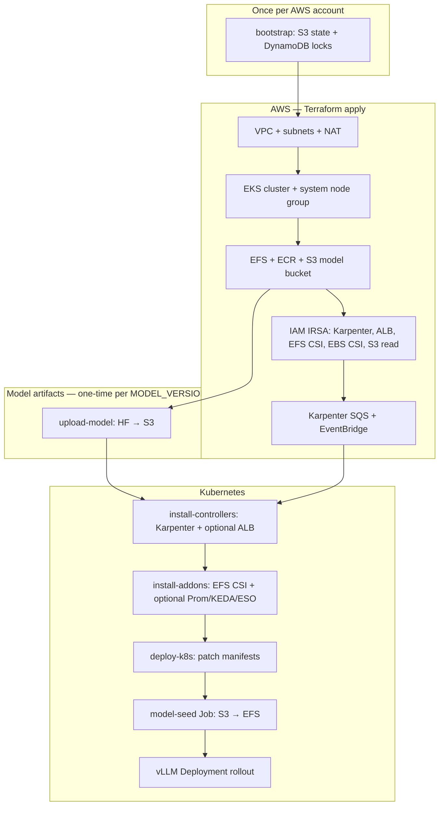

# Deploy flow

End-to-end guide for bringing up **qwen-vllm** on EKS — from one-time bootstrap through Terraform, Helm add-ons, model upload, and vLLM rollout.

For teardown, see **[destroy.md](destroy.md)**. For dev roadmap steps, see **[design.md](design.md)**.

## Quick reference

| Goal | Command |
|------|---------|
| One-time state backend | `make bootstrap` |
| After partial destroy | `make fix-post-destroy TF_ENVIRONMENT=dev` |
| AWS infrastructure | `make apply TF_ENVIRONMENT=dev` |
| Upload model (once per version) | `make upload-model TF_ENVIRONMENT=dev` |
| Controllers + Helm | `make install-controllers` + `make install-addons` |
| Full K8s rollout | `make deploy-k8s TF_ENVIRONMENT=dev` |
| CI deploy | Push to `dev` or `main`, or Actions → Deploy |

Run all `make` commands from the **repository root**.

## High-level flow



## Environments

| | dev | prod |
|--|-----|------|
| Branch | `dev` | `main` |
| Cluster | `qwen-vllm-dev` | `qwen-vllm-prod` |
| Terraform path | `terraform/environments/dev` | `terraform/environments/prod` |
| State key | `dev/terraform.tfstate` | `prod/terraform.tfstate` |
| Default model | `Qwen/Qwen2.5-7B-Instruct` | `Qwen/Qwen3-8B` |
| Default GPU | `g5.2xlarge` | `g5.4xlarge` |
| Minimal path | Steps 1–5 (no ALB/KEDA/Prometheus on dev by default) | Full stack |

---

## Phase 0 — Bootstrap (once per AWS account)

Creates remote state backend (not part of environment deploy):

```bash
make bootstrap
# or: cd terraform/bootstrap && terraform init && terraform apply
```

| Created | Purpose |
|---------|---------|
| S3 `qwen-vllm-terraform-state` | Stores `dev/` and `prod/` tfstate |
| DynamoDB `qwen-vllm-terraform-locks` | Terraform state locking |

---

## Phase 1 — Terraform (`make apply`)

Provisions AWS resources for the selected environment.

```bash
make init TF_ENVIRONMENT=dev
make plan TF_ENVIRONMENT=dev
make apply TF_ENVIRONMENT=dev
make kubeconfig-dev
```

### Resources created

| Module | Resources |
|--------|-----------|
| **vpc** | VPC, public/private subnets, NAT, IGW, S3 gateway endpoint |
| **eks** | EKS cluster, system managed node group, addons (vpc-cni, coredns, kube-proxy, ebs-csi), KMS, SGs, OIDC |
| **efs** | EFS file system, mount targets, `/models` access point |
| **ecr** | ECR repo for vLLM + model-downloader images |
| **s3_models** | Model-artifacts bucket + vLLM S3 read IRSA |
| **karpenter** | SQS interruption queue, EventBridge rules, node IAM role, controller IRSA |
| **alb_controller** | ALB controller IRSA |
| **external_secrets** | External Secrets IRSA (prod path; dev skips ESO install by default) |

IAM roles are created by Terraform; Helm charts are installed **after** apply (avoids Terraform RBAC issues in CI).

### Re-deploy after destroy

If the model S3 bucket was preserved, `make apply` auto-imports it before Terraform runs (same in CI). For other orphaned resources (VPC subnets, EFS, NAT, etc.):

```bash
make fix-post-destroy TF_ENVIRONMENT=dev   # import orphaned AWS + S3 bucket
make apply TF_ENVIRONMENT=dev
```

---

## Phase 2 — Model upload (once per `MODEL_NAME` + `MODEL_VERSION`)

Canonical weights live in S3; EFS is a runtime cache.

```bash
# Optional for gated models
HF_TOKEN=hf_xxx make sync-hf-secret TF_ENVIRONMENT=dev

# ~15 GB for 7B; skips if version already in S3
make upload-model TF_ENVIRONMENT=dev
```

| Step | What happens |
|------|--------------|
| Download | Hugging Face → local (`/tmp/{model}-{version}`) |
| Upload | Local → `s3://{prefix}-model-artifacts/models/{model}/{version}/` |
| Manifest | Writes `.model-manifest.json` (used by deploy pre-check) |

Set `MODEL_VERSION=v2` to promote a new revision. Use `FORCE_UPLOAD=1` to overwrite an existing version.

**CI:** Deploy workflow verifies the S3 manifest exists before `deploy-k8s`. Upload locally first, or ensure a previous upload left weights in the preserved bucket.

---

## Phase 3 — Controllers (`make install-controllers`)

```bash
make install-controllers TF_ENVIRONMENT=dev
```

| Component | When | Notes |
|-----------|------|-------|
| **Karpenter** | Always | 1 replica on dev, 2 on prod |
| **ALB Controller** | `DEV_ENABLE_ALB=1` or prod | Skipped on dev minimal path |

Waits for EKS API access, then `helm upgrade --install`.

---

## Phase 4 — Helm add-ons (`make install-addons`)

```bash
make install-addons TF_ENVIRONMENT=dev
```

| Add-on | dev (default) | dev (flags) | prod |
|--------|---------------|-------------|------|
| AWS EFS CSI | ✅ | ✅ | ✅ |
| External Secrets | ❌ | ❌ | ✅ |
| kube-prometheus-stack | ❌ | `DEV_ENABLE_PROMETHEUS=1` (slim) | ✅ (full) |
| KEDA | ❌ | `DEV_ENABLE_KEDA=1` | ✅ |

Chart versions: `scripts/lib/chart-versions.sh`.

Optional dev shortcuts:

```bash
make install-prometheus TF_ENVIRONMENT=dev   # Step 6
make install-keda TF_ENVIRONMENT=dev       # Step 7 (also installs Prometheus)
make install-alb TF_ENVIRONMENT=dev        # Step 8 (DEV_ALB_HTTP_ONLY=1 for HTTP)
make install-router TF_ENVIRONMENT=dev     # Step 9 (DEV_ENABLE_ROUTER=1)
make install-gateway TF_ENVIRONMENT=dev    # Step 9 + LMCache (DEV_ENABLE_LMCACHE=1)
```

---

## Phase 5 — Build images (`make build-image`)

```bash
make build-image TF_ENVIRONMENT=dev
```

Pushes to ECR:

| Image tag | Purpose |
|-----------|---------|
| `v0.8.4` | vLLM serving container |
| `model-downloader-v2` | S3 → EFS sync (model-seed job) |

CI skips rebuild if the tag already exists (`SKIP_ECR_BUILD_IF_EXISTS=1`).

---

## Phase 6 — Kubernetes deploy (`make deploy-k8s`)

```bash
make deploy-k8s TF_ENVIRONMENT=dev
```

`scripts/deploy-k8s.sh` runs in order:

1. **patch-manifests** — inject Terraform outputs into `kubernetes/.generated/{env}/`
2. **S3 pre-check** — fail fast if `.model-manifest.json` missing
3. **External Secrets** (prod only) — ClusterSecretStore + HF token ExternalSecret
4. **Karpenter** — EC2NodeClass + NodePool (`g5-ondemand`; spot pool on prod only)
5. **NVIDIA device plugin**
6. **ServiceAccount `vllm`** (IRSA for S3 read) — before model-seed
7. **model-seed Job** — sync S3 → EFS on a system node (waits up to 60m)
8. **vLLM Deployment** + Service (+ LMCache ConfigMap when `ENABLE_LMCACHE=1`)
9. **Gateway router** — if `ENABLE_ROUTER=1` (prod always; dev `DEV_ENABLE_ROUTER=1`)
10. **Ingress** — if `DEV_ENABLE_ALB=1` or prod (backend: `vllm-router` when router on)
11. **Monitoring / KEDA** — if respective flags set (includes router ServiceMonitor when router + Prometheus)

### Model path at runtime

```
HuggingFace  →  upload-model  →  S3 (canonical)
                                    ↓
                              model-seed Job
                                    ↓
                              EFS /models/{model}/{version}
                                    ↓
                              vLLM pod (init re-syncs on version change)
```

Default dev path: `MODEL_PATH=/models/Qwen2.5-7B-Instruct/v1`

### Verify (Step 4)

```bash
kubectl port-forward -n vllm svc/vllm-qwen 8000:8000
curl http://localhost:8000/v1/models
curl http://localhost:8000/v1/chat/completions \
  -H "Content-Type: application/json" \
  -d '{"model":"/models/Qwen2.5-7B-Instruct/v1","messages":[{"role":"user","content":"hi"}],"max_tokens":32}'
```

---

## CI deploy (GitHub Actions)

**Workflow:** `.github/workflows/deploy.yml`

| Trigger | Environment |
|---------|-------------|
| Push to `dev` | dev |
| Push to `main` | prod |
| Manual dispatch | chosen env |

### CI steps (in order)

1. `terraform init` + `terraform apply`
2. `install-controllers.sh`
3. `install-addons.sh`
4. Sync HF token → Secrets Manager (**prod only**)
5. Build + push vLLM image to ECR
6. Verify S3 model manifest
7. `deploy-k8s.sh`
8. Wait for vLLM rollout (45m dev / 20m prod)
9. Dev smoke test (`/v1/models` + chat completion)

Concurrency: one deploy per environment at a time.

### Required secrets / variables

See README **GitHub Actions Deploy** section. Minimum:

- Secrets: `AWS_ACCESS_KEY_ID`, `AWS_SECRET_ACCESS_KEY`, `HF_TOKEN`
- Variables: `MODEL_VERSION` (for CI S3 check)
- Dev optional: `DEV_ENABLE_PROMETHEUS`, `DEV_ENABLE_KEDA`, `DEV_ENABLE_ALB`, `DEV_ALB_HTTP_ONLY`, `DEV_ENABLE_ROUTER`, `DEV_ENABLE_LMCACHE`

---

## Dev roadmap steps (summary)

| Step | Goal | Enable |
|------|------|--------|
| 1 | EKS cluster | `make apply` |
| 2 | GPU nodes | Karpenter NodePool (in `deploy-k8s`) |
| 3 | vLLM serving | `make deploy-k8s` after `upload-model` |
| 4 | curl works | port-forward |
| 5 | CI smoke test | green Deploy workflow |
| 6 | Prometheus | `DEV_ENABLE_PROMETHEUS=1` |
| 7 | KEDA autoscale | `DEV_ENABLE_KEDA=1` |
| 8 | ALB ingress | `DEV_ENABLE_ALB=1` (+ `DEV_ALB_HTTP_ONLY=1` for HTTP) |
| 9 | Gateway router | prod always; dev `DEV_ENABLE_LMCACHE=1` optional — [gateway.md](gateway.md) |

Details: **[design.md](design.md)**

---

## Full local sequence (copy-paste)

### First-time dev deploy

```bash
make bootstrap                                    # once
make apply TF_ENVIRONMENT=dev
make upload-model TF_ENVIRONMENT=dev              # once per MODEL_VERSION
make build-image TF_ENVIRONMENT=dev
make install-controllers TF_ENVIRONMENT=dev
make install-addons TF_ENVIRONMENT=dev
make deploy-k8s TF_ENVIRONMENT=dev
```

### Rebuild after `make destroy` (model S3 preserved)

```bash
make fix-post-destroy TF_ENVIRONMENT=dev
make apply TF_ENVIRONMENT=dev
make build-image TF_ENVIRONMENT=dev               # skip if images still in ECR
make install-controllers TF_ENVIRONMENT=dev
make install-addons TF_ENVIRONMENT=dev
make deploy-k8s TF_ENVIRONMENT=dev                # skips HF re-upload if S3 intact
```

### Prod

```bash
make apply TF_ENVIRONMENT=prod
HF_TOKEN=hf_xxx make sync-hf-secret TF_ENVIRONMENT=prod
make upload-model TF_ENVIRONMENT=prod
make build-image TF_ENVIRONMENT=prod
make install-controllers TF_ENVIRONMENT=prod
make install-addons TF_ENVIRONMENT=prod
ACM_CERTIFICATE_ARN=arn:aws:acm:... \
INFERENCE_HOSTNAME=inference.example.com \
make deploy-k8s TF_ENVIRONMENT=prod
```

---

## Recovery (cluster exists, deploy stuck)

| Symptom | Action |
|---------|--------|
| Pending GPU pods | `make fix-gpu TF_ENVIRONMENT=dev` |
| Re-apply manifests only | `make deploy-k8s` |
| Bad K8s state | `AUTO_APPROVE=1 make delete-k8s` then `make deploy-k8s` |
| Stale Terraform lock | `LOCK_ID=<uuid> make force-unlock-terraform` |
| Apply conflicts after partial destroy | `make fix-post-destroy` then `make apply` |

GitHub: **Actions → Reset** (`fix-gpu`, `redeploy-k8s`, `reset-k8s`, `force-unlock`).

---

## Related docs

| Doc | Topic |
|-----|-------|
| [destroy.md](destroy.md) | Teardown flow + what gets destroyed |
| [design.md](design.md) | Dev roadmap, status tracker, defaults |
| [production-ha-slo.md](production-ha-slo.md) | Prod HA, probes, SLO alerts |
| [README](../README.md) | Prerequisites, secrets, policy gates |
