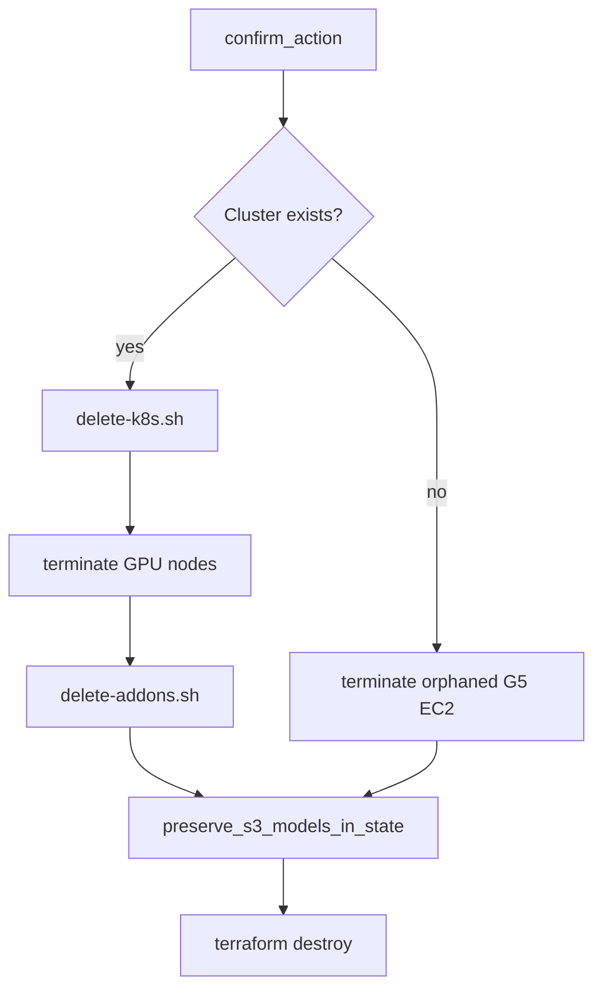

# Destroy guide

Full teardown for a `dev` or `prod` environment: Kubernetes workloads → Helm add-ons → GPU nodes → Terraform.

For an in-cluster reset that **keeps** EKS and Terraform, use `make delete-k8s` instead (see [README](../README.md)).

## Quick reference

| Goal | Command |
|------|---------|
| Full destroy | `AUTO_APPROVE=1 make destroy TF_ENVIRONMENT=dev` |
| Delete workloads only | `AUTO_APPROVE=1 make delete-k8s TF_ENVIRONMENT=dev` |
| Uninstall Helm add-ons only | `AUTO_APPROVE=1 make delete-addons TF_ENVIRONMENT=dev` |
| Recover after partial destroy | `make fix-post-destroy TF_ENVIRONMENT=dev` then `make apply` |

Unless `AUTO_APPROVE=1` is set, each command prompts you to type the environment name (`dev` or `prod`).

**Run destroy in one terminal.** Do not overlap destroy runs or interrupt with Ctrl+Z — that leaves stale Terraform locks and orphaned AWS resources.

## Destroy flow

`scripts/destroy.sh` runs these steps in order:



1. **Kubernetes** (`delete-k8s.sh`) — vLLM namespace, Karpenter pools, GPU nodes, monitoring manifests.
2. **GPU cleanup** (`terminate-gpu-nodes.sh`) — NodeClaims, force-delete GPU nodes, terminate remaining G5 instances via EC2 API.
3. **Helm** (`delete-addons.sh`) — Prometheus, KEDA, External Secrets, EFS CSI, Karpenter controller, ALB controller.
4. **Preserve S3** (`preserve-s3-models.sh`) — removes `module.s3_models` from Terraform state so the model bucket is not destroyed.
5. **Terraform** — `terraform destroy` for everything else in the environment state.

If the cluster was never deployed, steps 1–3 are skipped and Terraform destroy runs (or exits cleanly if state is empty).

## Preserved (not destroyed)

| Resource | Why |
|----------|-----|
| **Model-artifacts S3 bucket** (`{name_prefix}-model-artifacts`) | `prevent_destroy` + detached from state before destroy; weights kept for fast re-deploy |
| **Terraform state bucket** (`qwen-vllm-terraform-state`) | Bootstrap stack; `prevent_destroy`; not part of environment destroy |
| **DynamoDB lock table** (`qwen-vllm-terraform-locks`) | Bootstrap stack; survives environment destroy |
| **Secrets Manager secrets** (e.g. HF token) | Not managed by this Terraform stack |
| **Hugging Face cache on your laptop** | Local only |

After destroy, re-import the S3 bucket before the next apply:

```bash
make import-s3-models TF_ENVIRONMENT=dev
```

## List destroyed

### Phase 1 — Kubernetes (`delete-k8s`)

| Resource | Namespace / scope |
|----------|-------------------|
| vLLM Deployment, Service, Ingress | `vllm` |
| model-seed Job, ConfigMaps, PVCs | `vllm` |
| KEDA ScaledObjects | `vllm` |
| ExternalSecrets | `vllm` |
| Prometheus / ServiceMonitor manifests | `monitoring` (if generated) |
| Karpenter NodeClaims, NodePools (`g5-ondemand`, `g5-spot`) | cluster |
| EC2NodeClass (`g5-gpu`) | cluster |
| NVIDIA device plugin | `kube-system` |
| ClusterSecretStore (`aws-secrets-manager`) | cluster |
| `vllm` namespace | — |

### Phase 2 — Helm add-ons (`delete-addons`)

| Helm release | Namespace |
|--------------|-----------|
| `kube-prometheus-stack` | `monitoring` |
| `keda` | `keda` |
| `external-secrets` | `external-secrets` |
| `aws-efs-csi-driver` | `kube-system` |
| `karpenter` | `kube-system` |
| `aws-load-balancer-controller` | `kube-system` |

Namespaces `monitoring`, `keda`, and `external-secrets` are deleted after uninstall.

### Phase 3 — GPU EC2 instances

| Resource | Notes |
|----------|-------|
| Karpenter-provisioned G5 instances | Terminated via kubectl + EC2 API fallback |
| Orphaned G5 instances (cluster tag) | Terminated even if cluster API is gone |

### Phase 4 — Terraform (`terraform destroy`)

Typical dev destroy: **57 resources** (exact count varies with optional modules and IRSA roles).

#### VPC (`module.vpc`)

| Resource |
|----------|
| VPC |
| Public subnets (2 AZs) |
| Private subnets (2 AZs) |
| Internet gateway |
| NAT gateway + Elastic IP |
| Public / private route tables and associations |
| Default NACL, route table, security group (managed tags) |
| S3 gateway VPC endpoint |

#### EKS (`module.eks`)

| Resource |
|----------|
| EKS cluster |
| EKS managed node group (`system`) + EC2 instances |
| Cluster addons: `vpc-cni`, `coredns`, `kube-proxy`, `aws-ebs-csi-driver` |
| CloudWatch log group (`/aws/eks/{cluster}/cluster`) |
| Cluster + node security groups and rules |
| KMS key + alias (cluster encryption) |
| IAM: cluster role, node group role, EBS CSI IRSA, EFS CSI IRSA, CloudWatch agent IRSA |
| OIDC provider |

#### EFS (`module.efs`)

| Resource |
|----------|
| EFS file system |
| Mount targets (per AZ) |
| Access point (`/models`) |
| EFS security group |

#### ECR (`module.ecr`)

| Resource |
|----------|
| ECR repository (`{name_prefix}-vllm`) |
| Lifecycle policy |

#### Karpenter (`module.karpenter`)

| Resource |
|----------|
| SQS interruption queue + policy |
| EventBridge rules (spot interruption, rebalance, state change, health) |
| Karpenter node IAM role + instance profile |
| Karpenter controller IRSA |
| EKS access entry for Karpenter nodes |

#### ALB controller (`module.alb_controller`)

| Resource |
|----------|
| AWS Load Balancer Controller IRSA + IAM policy |

#### External Secrets (`module.external_secrets`)

| Resource |
|----------|
| External Secrets IRSA + Secrets Manager read policy |

#### Not destroyed (S3 models — `module.s3_models`)

Detached from state before destroy; remains in AWS:

| Resource kept in AWS |
|---------------------|
| S3 bucket `{name_prefix}-model-artifacts` |
| Bucket versioning, encryption, public-access block, bucket policy |
| Uploaded model objects under `models/` |

IRSA for vLLM S3 read is removed from state with the module; it is recreated on the next `make apply`.

## After destroy

Rebuild the same environment:

```bash
make import-s3-models TF_ENVIRONMENT=dev   # if bucket was preserved
make apply TF_ENVIRONMENT=dev
make build-image TF_ENVIRONMENT=dev
make deploy-k8s TF_ENVIRONMENT=dev
```

If apply fails with resources that already exist in AWS (`InvalidSubnet.Conflict`, `MountTargetConflict`, `BucketAlreadyExists`, CloudWatch log group exists, NAT gateway conflict):

```bash
make fix-post-destroy TF_ENVIRONMENT=dev
make apply TF_ENVIRONMENT=dev
```

## Troubleshooting

| Symptom | Fix |
|---------|-----|
| `prevent_destroy` on S3 bucket | Ensure `preserve_s3_models_in_state` ran (included in `make destroy`). If state still has `module.s3_models`, run `make import-s3-models` is wrong — run destroy again or manually `terraform state rm module.s3_models`. |
| Stale Terraform lock | `LOCK_ID=<uuid> TF_ENVIRONMENT=dev make force-unlock-terraform` |
| Destroy stuck on GPU nodes | Wait for `terminate-gpu-nodes`; or manually terminate G5 instances in EC2 console |
| Partial destroy / orphaned VPC | `make fix-post-destroy TF_ENVIRONMENT=dev` then `make apply` |
| `kubectl` auth errors during destroy | Destroy continues to Terraform; GPU cleanup uses EC2 API fallback |

## Related scripts

| Script | Role |
|--------|------|
| `scripts/destroy.sh` | Orchestrates full teardown |
| `scripts/delete-k8s.sh` | Workloads only |
| `scripts/delete-addons.sh` | Helm only |
| `scripts/lib/preserve-s3-models.sh` | Detach S3 module from state |
| `scripts/lib/terminate-gpu-nodes.sh` | G5 cleanup |
| `scripts/fix-terraform-drift.sh` | Import orphaned AWS resources |
| `scripts/import-s3-models.sh` | Re-attach preserved S3 bucket to state |
